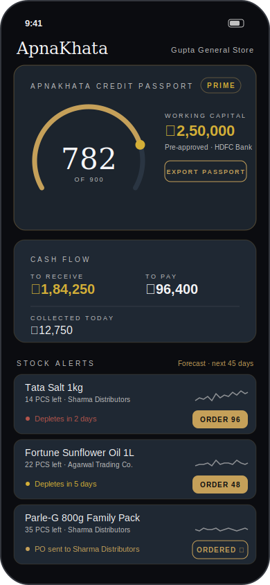
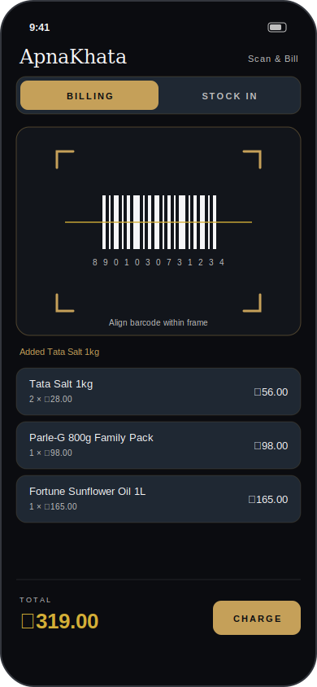

# ApnaKhata

A premium B2B ledger, billing, and intelligent inventory ecosystem for the Indian MSME
supply chain — connecting **Distributors** (wholesalers) and **Shop Owners** (kirana /
retailers) on a single, bank-grade financial rail.

## Run the whole app (one command)

Requires Docker.

```bash
git clone https://github.com/abhay2993/apnakhata && cd apnakhata
docker compose up --build
```

This starts PostgreSQL, **applies all migrations and seeds demo data**, runs the API
gateway, the batch worker, and the web UI. Then open:

- **Web app** → http://localhost:5173 — the dashboard shows a green **LIVE** badge and
  real data served by the API (demo login `gupta@demo.in`).
- **API** → http://localhost:8080/health, all routes under `/v1` (see
  [`docs/ARCHITECTURE.md`](docs/ARCHITECTURE.md)).

The API key (`demo-key`) and demo user are baked in for local use only. Config lives in
[`docker-compose.yml`](docker-compose.yml) / [`.env.example`](.env.example).

### Run pieces individually (no Docker)

```bash
# 1. Postgres running locally, then:
cd backend && npm install && npm run build
DATABASE_URL=postgres://…/apnakhata npm run migrate   # schema + all migrations
DATABASE_URL=postgres://…/apnakhata npm run seed      # demo data
DATABASE_URL=postgres://…/apnakhata APNAKHATA_API_KEY=demo-key npm start   # API on :8080
DATABASE_URL=postgres://…/apnakhata npm run worker    # daily jobs (separate process)

# 2. Web UI pointed at the API:
cd ../web && npm install
VITE_API_URL=http://localhost:8080 VITE_API_KEY=demo-key npm run dev   # :5173
```

Leave `VITE_API_URL` unset to run the web UI in standalone demo mode (what Vercel builds).

## App preview

**Live on Vercel:** this repo's Vercel connection builds [`web/`](web/) — an
interactive browser preview of the app, configured via the root
[`vercel.json`](vercel.json). Push to the connected branch and open your Vercel
deployment URL to use it. Six tabs cover the whole product:

- **Home** — credit passport, cash flow, business-health snapshot, a **festival demand
  planner** (proactive "stock up before Diwali" advice), and forecast stock alerts + one-tap reorder.
- **Khata** — customer udhaar ledger with **voice + vernacular entry**: speak or type
  "Ramesh ko paanch sau udhaar" and it's parsed into a ledger entry. **Offline-first** — entries
  captured with no connectivity queue locally and reconcile on reconnect (a "pending sync"
  badge shows the queue). A language switcher drives the UI in Hindi, Marathi, Gujarati,
  Bengali, Tamil, Telugu, Kannada (English fallback).
- **Credit** — passport score + pillars, what-if simulator, score trend, BNPL financing, bank pre-approvals.
- **Market** — search wholesalers (each with a **reliability rating** from disputes + on-time
  deliveries), browse catalog with trade schemes, place an order.
- **GST** — filing summary (GSTR-1/3B), e-invoicing, GSTR-2B input-tax-credit matching, e-way bills.
- **More** — **Working Capital** (anchor-led supply-chain finance: connect bank via Account
  Aggregator → competing lender offers → disburse), **Credit Line** (a RuPay credit line on
  UPI — pay distributors from a sanctioned revolving line, not a bank balance), Analytics,
  Ledger (bills, liquidity-timed reminders, EMI, **UPI AutoPay mandates**), **Cash Drawer**
  (daily cash-vs-digital reconciliation), **Benchmarks** (anonymised peer/consortium
  intelligence — margin percentile, velocity lags, assortment gaps), Live Inventory, Scan & Bill.

The **WhatsApp-first** bot rides on top of the same services: a retailer texts an order to
a distributor and it auto-parses into a purchase order; a shopkeeper posts khata entries by
message; a customer texts to check their outstanding balance (webhook at
`/integrations/webhooks/whatsapp`).

Every screen runs **live against the API** when `VITE_API_URL` is set (the docker-compose
stack), and on **demo data** otherwise (the standalone Vercel build) — a LIVE/DEMO badge
shows which. Voice uses the browser's Web Speech API with a typed fallback; offline entries
sync through `POST /v1/sync/push` when the API returns.

GitHub itself can't execute a React Native app, so these rendered previews
(mirroring the real components in `mobile/src/screens/`) are also embedded
directly in the repo. To run the real mobile app, see
[`mobile/README.md`](mobile/README.md).

| Dashboard | Scan & Bill |
| :---: | :---: |
|  |  |

## What lives where

| Path | Purpose |
| --- | --- |
| `docs/ARCHITECTURE.md` | Full technical specification: system architecture, settlement engine, webhook gateway, ML forecasting design, credit passport, UI design system. |
| `database/schema.sql` | PostgreSQL DDL — users, inventory, transactions ledger, payment allocations (FIFO settlement), credit score metrics, stock movement time-series. |
| `database/migrations/001_payments_ledger.sql` | Payments & ledger extensions — UPI collection + auto-reconciliation, reminder policies, EMI plans, interest accrual, dispute/credit-note workflow, with SERIALIZABLE-safe settlement functions. |
| `backend/src/services/UpiCollectionService.ts` | Generates UPI deep links per invoice and reconciles UTR webhooks straight into the FIFO engine. |
| `backend/src/services/PaymentReminderService.ts` | Escalating WhatsApp/SMS reminders driven by aging buckets, with cadence throttling. |
| `backend/src/services/PaymentPlanService.ts` | Restructures an invoice into an EMI schedule of installments tracked against the parent. |
| `backend/src/services/InterestAccrualService.ts` | Per-distributor grace period + daily late-fee accrual, stored separately from principal. |
| `backend/src/services/DisputeService.ts` | Dispute lifecycle behind `is_disputed`, resolving via signed `CREDIT_NOTE` ledger rows. |
| `database/migrations/002_inventory_forecasting.sql` | Inventory extensions — purchase orders, barcodes, expiry-aware batches (FEFO), multi-location stock, demand-forecast store, with atomic goods-receipt/consume/transfer functions. |
| `backend/src/services/PurchaseOrderService.ts` | One-tap reorder: forecast recommendation → SUBMITTED PO; goods receipt raises the ledger invoice and stocks in batches atomically. |
| `backend/src/services/BarcodeInventoryService.ts` | Camera-scan backend: barcode lookup, batch stock-in, FEFO billing. |
| `backend/src/services/BatchExpiryService.ts` | Near-expiry alerts, expired write-off, and the batch payload for expiry-aware forecasting. |
| `backend/src/services/WarehouseService.ts` | Multi-location stock: godowns, FEFO transfers, per-location holdings. |
| `backend/src/services/DistributorDemandService.ts` | Distributor-side rollup of retailer forecasts for upstream procurement planning. |
| `mobile/src/api/client.ts` | Typed mobile API client (reorder, barcode lookup, stock-in, checkout). |
| `backend/src/server.ts` + `backend/src/http/` | Express API gateway exposing every service under `/v1` — the routes the mobile/web clients target. `npm run build && DATABASE_URL=… npm start`. |
| `backend/src/worker.ts` + `backend/src/jobs/` | Scheduled daily jobs (interest accrual, expiry write-off, nightly credit refresh, payment reminders) on a dependency-free scheduler. `DATABASE_URL=… TZ=Asia/Kolkata npm run worker`. |
| `backend/src/db/migrate.ts` + `seed.ts` | Idempotent migration runner (tracked in `schema_migrations`) and demo seed. `npm run migrate && npm run seed`. |
| `backend/src/services/DashboardService.ts` | One-call home-screen read model (credit summary, cash flow, forecast stock alerts) behind `GET /v1/dashboard`. |
| `docker-compose.yml` + `backend/Dockerfile` + `web/Dockerfile` | Full stack in one command — db, migrate+seed, api, worker, live web UI. |
| `web/src/api.ts` | Web API client; the dashboard fetches live data when `VITE_API_URL` is set, else falls back to demo. |
| `database/migrations/005_marketplace_integrations.sql` | Dealer catalog (`dealer_products`) + billing integrations (`api_integrations`, `integration_events`). |
| `backend/src/services/DealerDirectoryService.ts` | Marketplace — dealer/product search and catalog; shopkeepers order via `POST /v1/purchase-orders/from-catalog`. |
| `backend/src/services/IntegrationService.ts` + `backend/src/events/` | External billing/POS webhook ingestion (HMAC, idempotent, FEFO) → live inventory; poll `/v1/inventory/live` or subscribe to the SSE stream. |
| `web/src/screens/Marketplace.tsx` | Web Market tab — search wholesalers, browse catalog, place an order (live or demo). |
| `database/migrations/006_bnpl_itc_eway.sql` | BNPL financings, GSTR-2B records, e-way bills. |
| `backend/src/services/BnplService.ts` | Point-of-purchase working-capital financing — the NBFC settles a distributor bill, the shopkeeper repays over a short tenure; limit/fee from the credit score. |
| `backend/src/services/Gstr2bReconciliationService.ts` | GSTR-2B input-tax-credit matching — classifies purchases vs supplier-filed data and quantifies eligible / at-risk ITC. |
| `backend/src/services/EwayBillService.ts` + `backend/src/irp/EwbGateway.ts` | E-way bill generation above the ₹50k threshold via a pluggable EWB gateway. |
| `database/migrations/007_analytics_schemes.sql` | `dealer_schemes` (trade schemes); analytics is read-only over existing data. |
| `backend/src/services/AnalyticsService.ts` | Profit/margin per product, fastest movers, dead stock, and a business-health score (DIO/DSO/DPO, cash-conversion cycle, runway) — `GET /v1/analytics/profit` \| `/health`. |
| `backend/src/services/SchemeService.ts` | Distributor trade schemes — volume slabs, buy-x-get-y, flat-percent — applied at quote/order time in the marketplace. |
| `database/migrations/008_customers_voice.sql` | Customer khata — `customers`, `customer_ledger_entries` (source VOICE/MANUAL/WHATSAPP), `v_customer_balances` view. |
| `backend/src/nlp/CommandParser.ts` | Dependency-free NLP: romanised-Hindi number words ("paanch sau", "dhai sau", "do hazaar"), credit/payment intent, party extraction, order parsing. |
| `backend/src/services/CustomerLedgerService.ts` | Consumer-udhaar ledger with fuzzy customer matching; `recordFromVoice` interprets an utterance and posts the entry — `POST /v1/voice/ledger`, `/v1/customers`. |
| `backend/src/services/WhatsAppBotService.ts` + `backend/src/whatsapp/` | Two-way WhatsApp bot: retailer order→PO, shop-owner khata entry, customer balance lookup, routed by which business owns the receiving number. |
| `web/src/i18n.tsx` + `web/src/screens/Khata.tsx` | Vernacular UI (8 languages) + the Khata screen — Web Speech voice capture, typed fallback, live/demo customer balances, offline outbox with a pending-sync badge. |
| `database/migrations/009_offline_sync.sql` | Offline-first sync — a global `sync_seq` cursor on the synced tables + `client_operations` idempotency ledger (grow-only-set CRDT). |
| `backend/src/services/SyncService.ts` + `backend/src/http/syncRoutes.ts` | `push` (idempotent, replay-safe batch apply) / `pull` (delta since cursor) for the customer khata — the device outbox lands here. |
| `database/migrations/010_cash_drawer_mandates.sql` | Cash-drawer days + movements, and UPI AutoPay mandates + executions. |
| `backend/src/services/CashDrawerService.ts` | Daily cash reconciliation — opening float, cash in/out, expected vs counted close, variance. |
| `backend/src/services/UpiMandateService.ts` | UPI AutoPay / e-mandate — create → authorize (UMN) → execute a debit that settles FIFO; `executeDue` runs the due debits nightly. |
| `backend/src/services/SmartReminderService.ts` | Liquidity-timed reminders — learns each debtor's typical pay-day from payment history and suggests when to nudge. |
| `backend/src/services/DealerReliabilityService.ts` | Marketplace trust rating (0–5★) from dispute rate + on-time delivery + order completion, thin-file damped. |
| `backend/src/services/FestivalPlannerService.ts` | Festival demand planner — folds the stored forecast with festival uplift + lead time into a stock-up list with an order-by date. |
| `backend/src/http/opsRoutes.ts` | Routes for cash-drawer, mandates, smart-reminder suggestions, and the festival plan. |
| `web/src/screens/CashDrawer.tsx` | Cash Drawer screen — open/record/close with the variance surfaced (live or demo). |
| `database/migrations/011_supply_chain_finance.sql` | Anchor-led finance — AA consents + cash-flow summaries, OCEN loan applications, competing lender offers, disbursed loans. |
| `backend/src/finance/AccountAggregatorGateway.ts` | Pluggable Account Aggregator (Sahamati) gateway; the sandbox derives a coherent cash-flow profile from the borrower's own ledger throughput. |
| `backend/src/finance/OcenLenderNetwork.ts` | OCEN lender panel — each lender bids independently on the underwriting bundle (risk appetite, rate card, ticket ceiling, anchor discount). |
| `backend/src/services/AccountAggregatorService.ts` | AA consent lifecycle (create → approve → fetch) and the stored cash-flow summary that feeds underwriting. |
| `backend/src/services/SupplyChainFinanceService.ts` | The OCEN LSP: anchor-relationship signal + three-factor underwriting (passport + AA + anchor) → competing offers → accept, disbursing to settle the distributor's dues via FIFO. `/v1/scf/*`, `/v1/aa/*`. |
| `web/src/screens/SupplyChainFinance.tsx` | Working Capital screen — anchor relationship, AA bank connect, competing lender offers, disbursal (live or demo). |
| `database/migrations/012_credit_line_upi.sql` | Credit-line-on-UPI — `credit_lines` (revolving line + virtual RuPay card) and `credit_line_txns` (draws + repayments). |
| `backend/src/services/CreditLineService.ts` | RuPay credit line on UPI — passport-sized eligibility, issue, `payViaUpi` (draw settles the payee's dues via FIFO), revolving repay. `/v1/credit-line/*`. |
| `web/src/screens/CreditLine.tsx` | Credit Line screen — virtual RuPay card, utilisation meter, scan-and-pay a distributor, repay (live or demo). |
| `backend/src/services/PeerBenchmarkService.ts` | Anonymised consortium intelligence — margin percentile, velocity lags, and assortment gaps vs a same-state peer cohort. `GET /v1/analytics/benchmarks`. |
| `web/src/screens/Benchmarks.tsx` | Benchmarks screen — insights, margin-vs-peers, lagging products, and fast-movers to stock (live or demo). |
| `database/migrations/003_credit_banking.sql` | Credit & banking — daily score-history snapshots (auto-trigger), lender submission records. |
| `backend/src/services/creditScoring.ts` | Shared scoring math (weights, pillar formulas, tiers) — single source of truth for the evaluator and simulator. |
| `backend/src/services/CreditPassportService.ts` | Ed25519-signed "Credit Risk Passport": canonical JSON, per-user hash chain, deterministic signed PDF, tamper-evident verification. |
| `backend/src/services/CreditSimulatorService.ts` | What-if projections ("pay 10 days earlier → +21") using the exact evaluator math. |
| `backend/src/services/CreditHistoryService.ts` | Score trend series from the daily snapshots. |
| `backend/src/services/LenderSubmissionService.ts` + `backend/src/lenders/` | Submits signed passports to partner-bank sandboxes (SBI/ICICI/HDFC) for pre-approval. |
| `database/migrations/004_billing_compliance.sql` | GST — invoice line items with HSN + CGST/SGST/IGST splits, e-invoice records, GSTR-1 (B2B + HSN) views. |
| `backend/src/services/GstInvoiceService.ts` | GST-compliant invoicing (intra/inter-state tax split) and filing-ready GSTR-1 / GSTR-3B exports. |
| `backend/src/services/EInvoiceService.ts` + `backend/src/irp/` | E-invoicing / IRN generation via a pluggable IRP gateway, with turnover-threshold check and 24h cancellation. |
| `backend/src/services/ReceiptService.ts` | ESC/POS thermal bytes (with UPI QR), A4 PDF bill, and WhatsApp share link. |
| `mobile/src/screens/ScanScreen.tsx` | Camera barcode/QR scanner — billing cart and batch/expiry stock-in modes. |
| `services/forecasting/forecast.py` | FastAPI + Prophet stock-forecasting microservice (Indian festival seasonality, safety-stock index, reorder recommendations). |
| `services/forecasting/requirements.txt` | Python dependencies for the forecasting service. |
| `backend/src/services/CreditScoreEvaluator.ts` | Weighted credit scoring engine (300–900) with risk-tier classification, backed by the transactions ledger. |
| `mobile/src/screens/DashboardScreen.tsx` | React Native + TypeScript + NativeWind dashboard — credit score widget, cash-flow balances, forecast-driven stock alerts. |

## Core pillars

1. **Dual-sided digital khata** — real-time procurement + retail ledgers with an
   automated FIFO settlement engine and transactional SMS/WhatsApp notifications.
2. **Billing & POS integration** — ESC/POS thermal printing and a secured webhook
   gateway for Tally / Vyapar / Marg ERP ingestion.
3. **ML stock forecasting** — Prophet-based 90-day rolling demand model tuned for
   Indian retail seasonality (Diwali, Holi, wedding seasons).
4. **Bank-ready credit evaluation** — a transparent 300–900 score computed from actual
   ledger behavior, exportable as a cryptographically signed "ApnaKhata Credit Risk
   Passport" PDF for lender API integration.

See `docs/ARCHITECTURE.md` for the complete blueprint.
