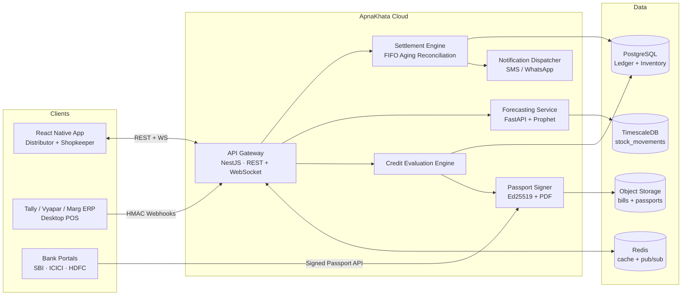

# ApnaKhata — Technical Specification & System Architecture

**Version:** 1.0 · **Status:** Blueprint · **Audience:** Engineering, Product, Bank Integration Partners

---

## 1. Architectural Blueprint

### 1.1 Technical Stack

| Layer | Technology | Rationale |
| --- | --- | --- |
| Mobile client | React Native + TypeScript, NativeWind (Tailwind CSS) | Single codebase for Android-first Indian MSME market; typed UI contracts. |
| API backend | NestJS (TypeScript) on Node.js | Modular DI architecture, first-class WebSocket gateway support, shared types with the mobile client. |
| Forecasting service | FastAPI (Python) + Prophet | Python ML ecosystem; Prophet handles holiday/seasonality regressors natively. |
| Primary database | PostgreSQL 16 | ACID financial ledgers, row-level locking for settlement, mature indexing. |
| Time-series analytics | TimescaleDB (Postgres extension) | Stock-level movements as hypertables; feeds the ML window queries without a second datastore. |
| Cache / session | Redis 7 | Session cache, rate-limit counters, WebSocket pub/sub fan-out. |
| Real-time sync | WebSocket (Socket.IO via NestJS gateway) | Live ledger balance updates to both parties on settlement. |
| Messaging | MSG91 / Gupshup (SMS + WhatsApp Business API) | Transactional settlement notifications. |
| Object storage | S3-compatible (bill attachments, signed credit passports) | Immutable bill evidence with pre-signed URL access. |

### 1.2 High-Level Topology

### 1.3 Data Model

The canonical DDL lives in [`database/schema.sql`](../database/schema.sql). Key relations:

- **`users`** — single table, `role` enum (`DISTRIBUTOR` | `SHOPKEEPER`); a shopkeeper may buy from many distributors (M:N expressed through the ledger).
- **`inventory`** — SKU-level stock owned by either persona; `minimum_threshold` drives static alerts, the forecasting service drives predictive alerts.
- **`transactions_ledger`** — every invoice/credit note between two parties; `balance_remaining` is the settlement engine's working column; `payment_status` is derived (`PAID`, `PARTIAL`, `DUE`).
- **`payments` + `payment_allocations`** — a payment is a single cash event; allocations record how the FIFO engine split it across open invoices. This preserves a full audit trail (a hard bank requirement).
- **`credit_score_metrics`** — materialized scoring output per user, recomputed by the credit engine.
- **`stock_movements`** — append-only time series (TimescaleDB hypertable) of every stock delta; the 90-day sales window for the ML model is a single range scan.

---

## 2. Core Feature Design

### 2.1 Dual-Sided Digital Ledger & Automated Settlement (FIFO Aging)

**Invariant:** for any (payer → payee) pair, an incoming payment must be applied to that
payer's open invoices **oldest-due-first** until exhausted; any residue becomes an
advance (credit balance).

Algorithm (executed inside a single `SERIALIZABLE` transaction — see
`apply_payment_fifo()` in `schema.sql`):

1. Lock the payer's open invoices toward the payee with `SELECT … FOR UPDATE` ordered by
   `due_date ASC, created_at ASC`.
2. Walk the list, writing a `payment_allocations` row per invoice touched, decrementing
   `balance_remaining`, and flipping `payment_status` to `PARTIAL` or `PAID`.
3. Any unapplied residue is stored as `payments.unapplied_amount` (advance credit,
   consumed by the next invoice raised).
4. On commit, publish a `ledger.settled` event to Redis pub/sub → WebSocket gateway
   pushes fresh balances to both parties → the Notification Dispatcher sends
   templated SMS/WhatsApp to payer and payee (idempotency key = payment UUID, so
   retries never double-send).

**Ledger extensions** (migration [`001_payments_ledger.sql`](../database/migrations/001_payments_ledger.sql),
services under `backend/src/services/`) all build on `apply_payment_fifo()`:

- **UPI collection + auto-reconciliation** — `UpiCollectionService` mints a dynamic
  `upi://pay?…&tr=<ref>` deep link per invoice; the inbound UTR webhook calls
  `reconcile_upi_collection()`, which books the payment and runs FIFO in one
  transaction. Idempotent on the transaction reference, so a replayed webhook is a
  no-op returning the original payment.
- **Automated reminders** — `PaymentReminderService` reads `invoices_due_for_reminder()`
  (per-invoice aging via `v_invoice_aging`), escalates by bucket per the distributor's
  `reminder_policies`, and throttles by cadence so concurrent runs never double-send.
- **EMI / partial-payment plans** — `PaymentPlanService` restructures an invoice's
  outstanding balance into a `payment_plans` + `payment_plan_installments` schedule;
  `record_plan_installment_payment()` books each installment against the parent invoice.
- **Interest / late-fee accrual** — `InterestAccrualService` applies per-distributor
  `distributor_credit_terms` (grace period + daily rate + optional cap); the daily
  `accrue_interest()` job records `interest_accruals` separately from principal (one row
  per invoice per day, idempotent), surfaced via `v_invoice_balance_with_interest`.
- **Dispute & credit-note workflow** — `DisputeService` drives `invoice_disputes` from
  raise → review → resolve; upholding calls `resolve_dispute_with_credit_note()`, which
  issues a `CREDIT_NOTE` ledger row (parties reversed, fully applied) and reduces the
  disputed invoice atomically. Accrual pauses while an invoice is flagged.

### 2.2 Billing System & POS Webhook Gateway

**Thermal printing:** the app renders invoices to ESC/POS byte streams
(`react-native-bluetooth-escpos-printer`) — 58 mm/80 mm templates, GST-compliant fields,
UPI QR footer.

**Webhook API for Tally / Vyapar / Marg ERP:**

| Endpoint | Method | Purpose |
| --- | --- | --- |
| `/v1/integrations/webhooks/sales` | POST | Push a completed retail sale (decrements inventory, writes `stock_movements`). |
| `/v1/integrations/webhooks/invoices` | POST | Push a B2B purchase invoice (creates a `transactions_ledger` row). |
| `/v1/integrations/webhooks/stock-sync` | POST | Bulk absolute stock reconciliation (nightly ERP sync). |

Security contract for every webhook call:

- **Auth:** per-integration API key (`X-Api-Key`) + HMAC-SHA256 of the raw body with a
  per-integration secret (`X-Signature`), constant-time compared.
- **Replay protection:** `X-Timestamp` must be within ±5 minutes; `X-Idempotency-Key`
  is unique-indexed so retries are exact no-ops returning the original response.
- **Rate limiting:** Redis token bucket per API key.
- **Versioning:** URL-versioned (`/v1/`); breaking payload changes mint `/v2/`.

### 2.3 Intelligent Inventory & ML Stock Forecasting

Implemented in [`services/forecasting/forecast.py`](../services/forecasting/forecast.py).

- **Input:** rolling 90-day daily sales history per SKU (from `stock_movements`),
  current stock, supplier lead time, desired service level.
- **Model:** Prophet with weekly + yearly seasonality and an explicit Indian retail
  holiday frame (Diwali, Dhanteras, Holi, Raksha Bandhan, Eid, Navratri/Dussehra, and
  the Nov–Feb / Apr–Jun wedding windows) with pre/post windows to capture stock-up
  behavior. Falls back to a weighted moving average when history is too sparse for
  Prophet (< 14 sale days).
- **Output per SKU:**
  - `predicted_out_of_stock_date` — first date cumulative forecast demand ≥ usable stock;
  - `safety_stock` — `z(service_level) × σ_demand × √lead_time_days`;
  - `recommended_order_qty` — forecast demand over `lead_time + review period`
    + safety stock − usable stock, rounded up to the distributor's pack size;
  - forecast series with confidence bounds for the mobile micro-charts.
- **Expiry-aware usable stock:** the request may carry the item's batch/expiry
  breakdown (`batches`, supplied by `BatchExpiryService.getBatchesForForecast()`).
  A FEFO waste model consumes forecast demand against the earliest-expiring batch
  first; units a batch still holds on its expiry date count as waste, shrinking
  usable stock — which pulls the stockout date earlier and raises the reorder qty.

**Inventory extensions** (migration [`002_inventory_forecasting.sql`](../database/migrations/002_inventory_forecasting.sql)):

- **One-tap reorder → PO** — `PurchaseOrderService.createFromForecast()` turns the
  stored recommendation into a SUBMITTED purchase order to the item's preferred
  distributor (the dashboard ORDER button calls this). Goods receipt
  (`receive_purchase_order()`) atomically closes the PO, raises the B2B invoice on
  the ledger, and stocks every line into expiry-aware batches — the procurement
  khata entry writes itself.
- **Barcode/QR scanning** — `barcode` column on inventory (unique per owner);
  `BarcodeInventoryService` resolves scans, stocks in batches, and sells FEFO via
  `consume_stock_fefo()`. The mobile `ScanScreen` (react-native-vision-camera v4)
  drives billing-cart and stock-in modes with no extra hardware.
- **Batch & expiry tracking** — `inventory_batches` under the owner-level aggregate;
  `v_expiring_stock` powers near-expiry alerts with value-at-risk;
  `write_off_expired()` runs daily and books ADJUSTMENT movements.
- **Multi-location stock** — `stock_locations` (store + godowns); `transfer_stock()`
  moves FEFO between locations preserving batch identity; aggregate owner stock is
  location-invariant.
- **Distributor demand rollup** — every forecast run is recorded in
  `demand_forecasts` (latest per item); `v_distributor_demand` aggregates demand
  across all retailers naming that distributor as preferred supplier, so
  distributors see tomorrow's reorders (SKU, total qty, retailer count, earliest
  stockout) before they arrive.

### 2.4 Bank-Ready Credit Evaluation Engine

Implemented in [`backend/src/services/CreditScoreEvaluator.ts`](../backend/src/services/CreditScoreEvaluator.ts).

Score range **300–900**, four weighted pillars computed strictly from observed ledger
behavior (non-custodial — ApnaKhata never touches funds):

| Pillar | Weight | Signal |
| --- | --- | --- |
| Repayment speed | 40% | Value-weighted days-to-clear relative to invoice due dates (early payment earns credit, delay decays exponentially). |
| Transaction consistency | 30% | Monthly trade volume/value regularity over 12 months (coefficient of variation + active-month coverage). |
| Supplier retention & disputes | 20% | Tenure-weighted stability of B2B relationships minus dispute rate. |
| Inventory turn | 10% | Days of Inventory Outstanding (DIO) vs. category benchmark. |

Tiers: **PRIME ≥ 740**, **SUBPRIME 580–739**, **HIGH_RISK < 580**.

**ApnaKhata Credit Risk Passport (PDF):**

1. Credit engine emits a canonical JSON report (score, pillar sub-scores, 12-month
   ledger aggregates, data-coverage disclosure).
2. Report is rendered to PDF/A; the SHA-256 of the canonical JSON is signed with the
   platform's **Ed25519** key; signature + key ID are embedded in the PDF (visible
   block + XMP metadata) and as a QR verification link.
3. Banks verify via `GET /v1/credit-passport/{passportId}/verify` (returns the
   canonical JSON, signature, and public key) — or fully offline against ApnaKhata's
   published public key. Any PDF tampering breaks the hash; any JSON tampering breaks
   the signature.
4. Every passport issuance is recorded in an append-only, hash-chained audit table so
   historical passports remain provable.

---

## 3. UI/UX Design System — "Private Banking" Aesthetic

No neon, no clutter, no cartoon iconography. The reference is a premium investment-bank
terminal: dark, calm, gold-accented, typographically confident.

### 3.1 Design Tokens

| Token | Value | Usage |
| --- | --- | --- |
| `obsidian` | `#0B0C10` | App background |
| `charcoal` | `#1F2833` | Card surfaces |
| `gold` | `#C5A059` | Primary accent, borders, score arc |
| `goldBright` | `#D4AF37` | Emphasis numerals, active states |
| `slate` | `#C0C0C0` | Secondary text, dividers |
| `alabaster` | `#F5F5F7` | Primary typography |
| `danger` | `#B4544B` (muted oxide red) | Critical stock / overdue — deliberately desaturated |

### 3.2 Typography & Components

- **Type:** Inter (UI), Playfair Display (display headings, large balance figures).
  Balance figures render at 34–40 pt with tabular numerals.
- **Cards:** charcoal surfaces, 1 px gold-tinted borders at 25–35% opacity, 16 px
  radius, soft elevation; glassmorphic overlays only on the hero credit widget.
- **Charts:** thin-stroke micro-charts (sparklines, score arc) in gold/slate on
  transparent backgrounds — no gridline noise.
- **Iconography:** 1.5 px stroke line icons only; no filled emoji-style glyphs.

The reference implementation is [`mobile/src/screens/DashboardScreen.tsx`](../mobile/src/screens/DashboardScreen.tsx).
