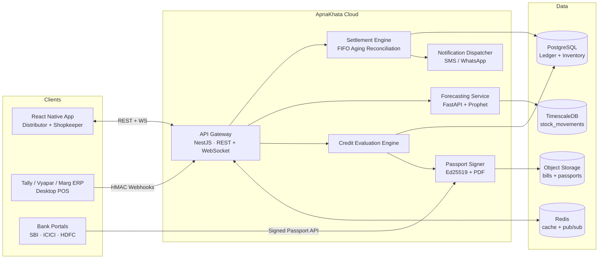

# ApnaKhata — Technical Specification & System Architecture

**Version:** 1.0 · **Status:** Blueprint · **Audience:** Engineering, Product, Bank Integration Partners

---

## 1. Architectural Blueprint

### 1.1 Technical Stack

| Layer | Technology | Rationale |
| --- | --- | --- |
| Mobile client | React Native + TypeScript, NativeWind (Tailwind CSS) | Single codebase for Android-first Indian MSME market; typed UI contracts. |
| API backend | Express (TypeScript) on Node.js | Shipped in `backend/src/server.ts` + `backend/src/http/`: every service exposed under `/v1` behind API-key + identity middleware (JWT slot marked in `middleware.ts`). Dependency-light; a NestJS migration path stays open if module DI is needed later. |
| Batch worker | Node.js (`backend/src/worker.ts` + `jobs/`) | Separate process running the daily jobs — interest accrual (00:30), expiry write-off (01:00), nightly credit refresh (02:00), payment reminders (10:00) — on a dependency-free chained-`setTimeout` scheduler. Every job is idempotent per day, so missed/duplicate runs are safe. |
| Forecasting service | FastAPI (Python) + Prophet | Python ML ecosystem; Prophet handles holiday/seasonality regressors natively. |
| Primary database | PostgreSQL 16 | ACID financial ledgers, row-level locking for settlement, mature indexing. |
| Time-series analytics | TimescaleDB (Postgres extension) | Stock-level movements as hypertables; feeds the ML window queries without a second datastore. |
| Cache / session | Redis 7 | Session cache, rate-limit counters, WebSocket pub/sub fan-out. |
| Real-time sync | WebSocket (Socket.IO via NestJS gateway) | Live ledger balance updates to both parties on settlement. |
| Messaging | MSG91 / Gupshup (SMS + WhatsApp Business API) | Transactional settlement notifications. |
| Object storage | S3-compatible (bill attachments, signed credit passports) | Immutable bill evidence with pre-signed URL access. |

### 1.2 High-Level Topology

### 1.3 Data Model

The canonical DDL lives in [`database/schema.sql`](../database/schema.sql). Key relations:

- **`users`** — single table, `role` enum (`DISTRIBUTOR` | `SHOPKEEPER`); a shopkeeper may buy from many distributors (M:N expressed through the ledger).
- **`inventory`** — SKU-level stock owned by either persona; `minimum_threshold` drives static alerts, the forecasting service drives predictive alerts.
- **`transactions_ledger`** — every invoice/credit note between two parties; `balance_remaining` is the settlement engine's working column; `payment_status` is derived (`PAID`, `PARTIAL`, `DUE`).
- **`payments` + `payment_allocations`** — a payment is a single cash event; allocations record how the FIFO engine split it across open invoices. This preserves a full audit trail (a hard bank requirement).
- **`credit_score_metrics`** — materialized scoring output per user, recomputed by the credit engine.
- **`stock_movements`** — append-only time series (TimescaleDB hypertable) of every stock delta; the 90-day sales window for the ML model is a single range scan.

---

## 2. Core Feature Design

### 2.1 Dual-Sided Digital Ledger & Automated Settlement (FIFO Aging)

**Invariant:** for any (payer → payee) pair, an incoming payment must be applied to that
payer's open invoices **oldest-due-first** until exhausted; any residue becomes an
advance (credit balance).

Algorithm (executed inside a single `SERIALIZABLE` transaction — see
`apply_payment_fifo()` in `schema.sql`):

1. Lock the payer's open invoices toward the payee with `SELECT … FOR UPDATE` ordered by
   `due_date ASC, created_at ASC`.
2. Walk the list, writing a `payment_allocations` row per invoice touched, decrementing
   `balance_remaining`, and flipping `payment_status` to `PARTIAL` or `PAID`.
3. Any unapplied residue is stored as `payments.unapplied_amount` (advance credit,
   consumed by the next invoice raised).
4. On commit, publish a `ledger.settled` event to Redis pub/sub → WebSocket gateway
   pushes fresh balances to both parties → the Notification Dispatcher sends
   templated SMS/WhatsApp to payer and payee (idempotency key = payment UUID, so
   retries never double-send).

**Ledger extensions** (migration [`001_payments_ledger.sql`](../database/migrations/001_payments_ledger.sql),
services under `backend/src/services/`) all build on `apply_payment_fifo()`:

- **UPI collection + auto-reconciliation** — `UpiCollectionService` mints a dynamic
  `upi://pay?…&tr=<ref>` deep link per invoice; the inbound UTR webhook calls
  `reconcile_upi_collection()`, which books the payment and runs FIFO in one
  transaction. Idempotent on the transaction reference, so a replayed webhook is a
  no-op returning the original payment.
- **Automated reminders** — `PaymentReminderService` reads `invoices_due_for_reminder()`
  (per-invoice aging via `v_invoice_aging`), escalates by bucket per the distributor's
  `reminder_policies`, and throttles by cadence so concurrent runs never double-send.
- **EMI / partial-payment plans** — `PaymentPlanService` restructures an invoice's
  outstanding balance into a `payment_plans` + `payment_plan_installments` schedule;
  `record_plan_installment_payment()` books each installment against the parent invoice.
- **Interest / late-fee accrual** — `InterestAccrualService` applies per-distributor
  `distributor_credit_terms` (grace period + daily rate + optional cap); the daily
  `accrue_interest()` job records `interest_accruals` separately from principal (one row
  per invoice per day, idempotent), surfaced via `v_invoice_balance_with_interest`.
- **Dispute & credit-note workflow** — `DisputeService` drives `invoice_disputes` from
  raise → review → resolve; upholding calls `resolve_dispute_with_credit_note()`, which
  issues a `CREDIT_NOTE` ledger row (parties reversed, fully applied) and reduces the
  disputed invoice atomically. Accrual pauses while an invoice is flagged.

### 2.2 Billing System & POS Webhook Gateway

**GST invoicing & compliance** (migration
[`004_billing_compliance.sql`](../database/migrations/004_billing_compliance.sql)):

- **GST-compliant invoices** — [`GstInvoiceService`](../backend/src/services/GstInvoiceService.ts)
  writes a ledger header plus HSN-coded `invoice_line_items` with the correct tax split:
  supplier state == place of supply → intra-state (CGST + SGST), otherwise inter-state
  (IGST), enforced by a DB CHECK so the two can never coexist on a line. Invoices are
  ordinary ledger rows, so they flow through FIFO settlement and credit scoring unchanged.
- **Filing-ready GSTR exports** — `gstr1Export()` returns GSTN-schema JSON (B2B grouped
  by counterparty GSTIN with rate-wise items, B2CS retail aggregate, and the table-12 HSN
  summary) off the `v_gstr1_b2b` / `v_gstr1_hsn` views; `gstr3bSummary()` gives the 3.1(a)
  outward-supply totals.
- **E-invoicing / IRN** — [`EInvoiceService`](../backend/src/services/EInvoiceService.ts)
  builds the INV-01 payload and registers it through a pluggable
  [`IrpGateway`](../backend/src/irp/IrpGateway.ts) (the sandbox mirrors the portal's
  real IRN derivation: SHA-256 over GSTIN + FY + doc-type + doc-no). Idempotent per
  invoice, turnover-threshold gated (₹5 cr), with 24-hour cancellation. Real GSP/NIC
  adapters implement the same interface.
- **GSTR-2B input-tax-credit matching** (migration
  [`006_bnpl_itc_eway.sql`](../database/migrations/006_bnpl_itc_eway.sql),
  [`Gstr2bReconciliationService`](../backend/src/services/Gstr2bReconciliationService.ts))
  — the biggest ITC leak is a purchase that doesn't match what the supplier filed. The
  GSTR-2B is imported (`gstr2b_records`) and matched against the buyer's purchase book
  (inward B2B invoices with GST from `invoice_line_items`) on (supplier GSTIN, invoice
  no.), classifying each line **MATCHED / MISMATCH / MISSING_IN_2B / MISSING_IN_BOOKS**
  and quantifying **eligible** ITC vs **at-risk** ITC (in the book, supplier hasn't filed)
  vs unrecorded credit — so nothing is silently lost.
- **E-way bills** — [`EwayBillService`](../backend/src/services/EwayBillService.ts) builds
  the payload from a GST invoice and mints a 12-digit e-way bill via a pluggable
  [`EwbGateway`](../backend/src/irp/EwbGateway.ts) for consignments above ₹50k, with the
  portal's validity rule (1 day per 200 km). Idempotent per invoice; cancellable within 24h.

**Thermal printing & receipts** — [`ReceiptService`](../backend/src/services/ReceiptService.ts)
renders three artifacts from an invoice: raw **ESC/POS** byte streams for 58 mm/80 mm
Bluetooth printers (init, alignment, bold, GST tax block, native QR with a UPI payment
link, feed + cut), an **A4 PDF** bill (dependency-free writer, embeds the IRN when
present), and a **WhatsApp** `wa.me` share link with a prefilled bill summary + PDF URL.

**Billing-system integration & live inventory** (migration
[`005_marketplace_integrations.sql`](../database/migrations/005_marketplace_integrations.sql),
[`IntegrationService`](../backend/src/services/IntegrationService.ts)) — connects an
external POS/ERP billing system (Tally, Vyapar, Marg, or any counter software) so a
consumer sale rung up there decrements ApnaKhata inventory in real time, giving the
shopkeeper one live stock view across every till:

- A shopkeeper registers an integration (`POST /v1/integrations`) and receives a public
  `api_key` + a `secret` (shown once).
- The billing system posts each sale to `POST /integrations/webhooks/sales` (mounted
  outside the `/v1` service-key guard). Auth per the security contract below:
  `X-Integration-Key`, `X-Signature` = hex HMAC-SHA256 of the **raw body** (constant-time
  compared), `X-Timestamp` within ±5 min, and `X-Idempotency-Key` unique per event
  (`integration_events` unique index → exact-once). Each line is consumed FEFO; a sale is
  never rejected — if our count is behind it consumes to zero and reports the shortfall.
- The shopkeeper live-tracks stock by polling `GET /v1/inventory/live` (current stock +
  last movement per SKU) or subscribing to the **SSE** stream
  `GET /v1/inventory/live/stream` (each sale pushes an `inventory` event via the in-process
  event bus; back it with Redis pub/sub for multi-instance).

Planned companion webhooks (same security contract): `/invoices` (B2B purchase → ledger
row) and `/stock-sync` (nightly absolute reconciliation). Rate limiting is a Redis token
bucket per key; breaking payload changes mint `/v2/`.

**Dealer marketplace** ([`DealerDirectoryService`](../backend/src/services/DealerDirectoryService.ts)):
distributors publish a catalog (`dealer_products`); a shopkeeper searches wholesalers by
product / category / city (`GET /v1/dealers/search`, trigram-indexed on product name),
browses a dealer's catalog, and orders via `POST /v1/purchase-orders/from-catalog` —
prices and MOQ come from the catalog (not the client) and the order flows through the
existing PO → goods-receipt → ledger pipeline. Surfaced in the web app's **Market** tab.

**Trade schemes** (migration
[`007_analytics_schemes.sql`](../database/migrations/007_analytics_schemes.sql),
[`SchemeService`](../backend/src/services/SchemeService.ts)): distributors attach real
schemes to their catalog — **volume slabs** (cheaper above a quantity), **buy-x-get-y**
(free goods), and **flat-percent** (seasonal, date-windowed), scoped to a SKU, a category,
or all products. `POST /v1/dealers/:id/quote` prices a cart against the best-benefit
applicable scheme per line (free units, discount, net); `from-catalog` orders apply the
same engine so the PO carries the discounted totals and free units.

### 2.5 Profit & Business-Health Analytics

[`AnalyticsService`](../backend/src/services/AnalyticsService.ts) turns the ledger into an
advisor, read-only over data already captured (inventory prices, `stock_movements`, the
ledger):

- **Profit** (`GET /v1/analytics/profit`) — per-product unit margin, gross profit, and
  revenue over a rolling window; **fastest movers** (by units sold); and **dead stock**
  (items with stock but no sales — capital tied up), each with the value at risk.
- **Business health** (`GET /v1/analytics/health`) — inventory value, DIO / DSO / DPO and
  the **cash-conversion cycle**, an estimated **cash-runway** (cash-positive vs days of
  buffer), and a 0–100 **health score** (margin 35% · turnover 30% · collections 20% ·
  dead-stock 15%) with a rating (STRONG / STABLE / WATCH / AT_RISK) and plain-language
  advice ("stock is turning slowly — trim slow movers").

### 2.6 Voice, Vernacular & WhatsApp-First Entry

The fastest ledger entry is the one you speak. Migration `008` adds the **customer khata**
the B2B ledger didn't cover — the consumer-udhaar book every kirana keeps: `customers`,
`customer_ledger_entries` (with a `source` of VOICE / MANUAL / WHATSAPP and the original
`transcript` for audit), and a `v_customer_balances` view where a positive balance means
the customer owes the shop.

- **NLP command parser** ([`nlp/CommandParser.ts`](../backend/src/nlp/CommandParser.ts)) —
  a dependency-free intent engine. Speech-to-text is a transport concern (on-device Web
  Speech API, or Bhashini / Google STT) that hands over a transcript; the parser turns
  *"Ramesh ko paanch sau udhaar"* into `{ RECORD_CREDIT, Ramesh, 500 }`. It understands
  romanised-Hindi number words including fractional prefixes (`sau`=100, `hazaar`=1000,
  `lakh`=100000, `dhai`=2.5, `derh`=1.5, `sava`=1.25), the `2k` shorthand, and disambiguates
  credit vs payment from keywords (`udhaar`/`likho` vs `jama`/`mile`) and postpositions
  (`ko`→credit, `se`/`ne`→payment). `parseOrder` splits *"10 salt aur 5 oil bhejo"* into line
  items.
- **Customer ledger** ([`CustomerLedgerService`](../backend/src/services/CustomerLedgerService.ts))
  — `recordFromVoice` parses and posts in one call, resolving the customer with forgiving
  name matching so spoken "Ramesh" hits the stored "Ramesh Kumar", creating a new customer
  only on genuine first mention. Low-confidence utterances are returned un-posted with a
  reason so the client can confirm. Exposed at `POST /v1/voice/ledger` and the
  `/v1/customers` CRUD.
- **Vernacular UI** ([`web/src/i18n.tsx`](../web/src/i18n.tsx)) — a dependency-free
  translation layer. English is the source of truth; Hindi, Marathi, Gujarati, Bengali,
  Tamil, Telugu and Kannada overlay the high-visibility chrome and fall back to English for
  anything unlocalised, so the UI is never blank. The chosen language also selects the Web
  Speech recognition locale (`hi-IN`, `ta-IN`, …). The **Khata** screen captures voice via
  `webkitSpeechRecognition` with a typed fallback and runs a trimmed client-side parser in
  demo mode.
- **WhatsApp-first bot** ([`WhatsAppBotService`](../backend/src/services/WhatsAppBotService.ts))
  — one inbound handler (`/integrations/webhooks/whatsapp`, mounted outside the `/v1` guard,
  with Meta's `hub.challenge` verification) routes by the business that owns the receiving
  number: a **distributor** inbox parses an order and raises a PO against its catalog
  (matching products, honouring MOQ); a **shopkeeper** inbox posts a khata entry when the
  sender is the owner, or replies with the outstanding balance when the sender is a customer.
  Outbound replies go through an injected `WhatsAppSender` (a WABA / Gupshup adapter in
  production; a recording stub in the sandbox). Production use needs an approved WhatsApp
  Business Account and message templates.

### 2.7 Offline-First Sync (grow-only-set CRDT)

Connectivity in kirana India is patchy, so the app must capture entries offline and
reconcile later. The customer khata is append-only, which makes this tractable without
conflict resolution: every entry is an immutable fact identified by a client-generated
`opId`. Merging two devices' logs is a **set-union** — idempotent, commutative,
associative — a grow-only-set CRDT; the balance is a fold over the merged set. Migration
`009` adds a global `sync_seq` cursor to the synced tables and a `client_operations` ledger.

- **Push** (`POST /v1/sync/push`) — a device flushes its outbox (a batch of ops). Each op is
  applied **at most once**: the handler claims the `opId` with `INSERT … ON CONFLICT DO
  NOTHING`; a row that's already there is a replay and returns `DUPLICATE` with the original
  entity ref, touching nothing. So an at-least-once client that retries after a dropped
  response never double-posts (proven: replaying a batch leaves the balance unchanged). A
  rejected op (bad amount) never poisons the rest of the batch.
- **Pull** (`GET /v1/sync/pull?since=`) — returns every customer and entry with
  `server_seq > since`, plus the new cursor, so a second device merges only the delta.
- **Client** ([`web/src/screens/Khata.tsx`](../web/src/screens/Khata.tsx)) — when a live POST
  fails, the entry is parsed locally, queued in a `localStorage` outbox (each with a UUID
  `opId`), and applied optimistically; a "pending sync" badge shows the queue depth. On the
  `online` event (and on mount) the outbox flushes through push and clears.

### 2.8 Cash Drawer, AutoPay, Smart Reminders, Reliability & Festival Planner

Five features that build on data the ledger already holds:

- **Cash-drawer reconciliation** ([`CashDrawerService`](../backend/src/services/CashDrawerService.ts))
  — the daily cash-vs-digital close: opening float, cash in/out, `expected = opening + Σin −
  Σout`, and `variance = counted − expected` at close. Migration `010`.
- **UPI AutoPay / e-mandate** ([`UpiMandateService`](../backend/src/services/UpiMandateService.ts))
  — recurring distributor payments: create → authorize (a generated UMN) → execute a debit
  that inserts a payment and settles it through `apply_payment_fifo`, so AutoPay reconciles
  exactly like a manual UPI collection. A nightly `autopay-mandates` job runs due debits,
  capped at the payer's actual outstanding dues.
- **Liquidity-timed reminders** ([`SmartReminderService`](../backend/src/services/SmartReminderService.ts))
  — learns each debtor's typical pay-day-of-month from payment history and suggests sending
  the nudge just before it, rather than on a blind fixed cadence. Read-only.
- **Dealer reliability rating** ([`DealerReliabilityService`](../backend/src/services/DealerReliabilityService.ts))
  — a 0–5★ marketplace trust signal from `0.40·(1−disputeRate) + 0.35·onTimeRate +
  0.25·completionRate`, thin-file damped toward a neutral 3.5 until ~10 observations, folded
  into dealer search results.
- **Festival demand planner** ([`FestivalPlannerService`](../backend/src/services/FestivalPlannerService.ts))
  — surfaces the forecaster's festival seasonality as advice: for each upcoming festival it
  combines the stored per-item forecast with a festival uplift and the supplier lead time
  into a stock-up list with an order-by date.

### 2.9 Anchor-Led Supply-Chain Finance (OCEN LSP + Account Aggregator)

The deepest moat: ApnaKhata holds the one thing lenders can't buy — the verified
distributor↔retailer relationship and its repayment history — and turns it into a lending
rail. It acts as an **OCEN Loan Service Provider**, underwriting from three signals no
competitor holds together and broadcasting one application to a panel of lenders that bid
against each other. Migration `011`; gateways under [`backend/src/finance/`](../backend/src/finance/).

- **Account Aggregator (Sahamati/AA)** — the consent lifecycle
  ([`AccountAggregatorService`](../backend/src/services/AccountAggregatorService.ts)):
  `createConsent` → the borrower approves in their AA app → `fetchFinancials` pulls a
  statement summary (monthly inflow/outflow, average and minimum balance, cheque bounces,
  inflow volatility). The sandbox gateway is deliberately **not random** — it derives a
  coherent cash-flow profile from the borrower's own ledger throughput, so demo underwriting
  is consistent with the rest of the app. This moves underwriting from score-only to
  cash-flow-based.
- **Anchor relationship** — the proprietary signal
  ([`SupplyChainFinanceService.getAnchorRelationship`](../backend/src/services/SupplyChainFinanceService.ts)):
  for a specific distributor, the retailer's invoice count, total trade, relationship tenure,
  and **on-time settlement rate** (computed from `payment_allocations` vs `due_date`) fold
  into a 0–1 strength. A strong relationship raises the grade, the limit, and — via each
  lender's anchor discount — the rate.
- **Three-factor underwriting** — `underwrite` combines the Credit Passport score (45%), the
  anchor strength (25%), and the AA cash-flow score (30%) into a composite → risk grade A–D
  and a recommended limit (a blend of ledger throughput and AA inflow, boosted by the anchor,
  capped by grade). Without AA connected it falls back to score (65%) + anchor (35%) and the
  rationale nudges the borrower to connect a bank.
- **OCEN offers** ([`OcenLenderNetwork`](../backend/src/finance/OcenLenderNetwork.ts)) — a
  panel (development bank, private bank, two NBFC/fintechs) each bids independently based on
  its risk appetite, rate card, ticket ceiling and anchor discount; only lenders whose policy
  admits the grade return an offer, sorted best-rate first — a genuine competitive marketplace.
- **Disbursal closes the loop** — `acceptOffer` marks the winning offer `ACCEPTED` (others
  `DECLINED`), and when the application is anchor-led it routes the proceeds to settle the
  retailer's outstanding dues to that distributor through `apply_payment_fifo`: the retailer's
  working capital pays the supplier and the debt moves to the lender, all in one transaction.

Why it's defensible: the anchor relationship and repayment graph are proprietary and compound
with every transaction (a data network effect), the AA/OCEN integration is a regulatory moat,
and working capital living on the rail is the ultimate switching cost. Real AA providers and
lenders implement the same gateway contracts behind their endpoints; the sandboxes make the
whole flow runnable and verifiable today.

### 2.10 Credit-Line-on-UPI + Embedded RuPay Card

NPCI enabled pre-sanctioned credit lines on UPI, and ApnaKhata is positioned to be the issuer
of record. [`CreditLineService`](../backend/src/services/CreditLineService.ts) (migration `012`)
sanctions a revolving line sized off the Credit Passport (tier ceiling scaled by score) and
mints a virtual RuPay card + a credit-line VPA (`shop.xxxx@apnakhata`). `payViaUpi` is the
crux: paying a distributor by scanning their UPI QR draws from the line, not a bank balance —
atomically it debits the available limit, writes the ledger payment (`method = 'UPI_CREDIT'`),
and settles the payee's dues through `apply_payment_fifo`. `repay` frees the limit back up, so
the line revolves. Because the payment rail and the credit sit in one place, this is the
stickiest lock-in in the stack. Routes under `/v1/credit-line/*`.

### 2.11 Peer Benchmarking / Consortium Intelligence

The pure-data moat: [`PeerBenchmarkService`](../backend/src/services/PeerBenchmarkService.ts)
compares a shop against a cohort of peers (same state, falling back to all shopkeepers) using
inventory + `stock_movements` that already flow through the network — comparisons a new
entrant simply cannot reproduce without scale. It returns three things, all **aggregates**
(no peer is ever named): a **margin percentile** (sales-weighted gross margin vs the peer
median), **velocity lags** (SKUs where the shop's weekly units trail the peer median by >10%),
and **assortment gaps** (SKUs carried by ≥50% of peers but not this shop, with the typical
peer weekly demand). From these it writes plain-language insights ("peers sell 60% more
Parle-G than you"; "5 fast-movers peers carry that you don't"). `GET /v1/analytics/benchmarks`.

### 2.3 Intelligent Inventory & ML Stock Forecasting

Implemented in [`services/forecasting/forecast.py`](../services/forecasting/forecast.py).

- **Input:** rolling 90-day daily sales history per SKU (from `stock_movements`),
  current stock, supplier lead time, desired service level.
- **Model:** Prophet with weekly + yearly seasonality and an explicit Indian retail
  holiday frame (Diwali, Dhanteras, Holi, Raksha Bandhan, Eid, Navratri/Dussehra, and
  the Nov–Feb / Apr–Jun wedding windows) with pre/post windows to capture stock-up
  behavior. Falls back to a weighted moving average when history is too sparse for
  Prophet (< 14 sale days).
- **Output per SKU:**
  - `predicted_out_of_stock_date` — first date cumulative forecast demand ≥ usable stock;
  - `safety_stock` — `z(service_level) × σ_demand × √lead_time_days`;
  - `recommended_order_qty` — forecast demand over `lead_time + review period`
    + safety stock − usable stock, rounded up to the distributor's pack size;
  - forecast series with confidence bounds for the mobile micro-charts.
- **Expiry-aware usable stock:** the request may carry the item's batch/expiry
  breakdown (`batches`, supplied by `BatchExpiryService.getBatchesForForecast()`).
  A FEFO waste model consumes forecast demand against the earliest-expiring batch
  first; units a batch still holds on its expiry date count as waste, shrinking
  usable stock — which pulls the stockout date earlier and raises the reorder qty.

**Inventory extensions** (migration [`002_inventory_forecasting.sql`](../database/migrations/002_inventory_forecasting.sql)):

- **One-tap reorder → PO** — `PurchaseOrderService.createFromForecast()` turns the
  stored recommendation into a SUBMITTED purchase order to the item's preferred
  distributor (the dashboard ORDER button calls this). Goods receipt
  (`receive_purchase_order()`) atomically closes the PO, raises the B2B invoice on
  the ledger, and stocks every line into expiry-aware batches — the procurement
  khata entry writes itself.
- **Barcode/QR scanning** — `barcode` column on inventory (unique per owner);
  `BarcodeInventoryService` resolves scans, stocks in batches, and sells FEFO via
  `consume_stock_fefo()`. The mobile `ScanScreen` (react-native-vision-camera v4)
  drives billing-cart and stock-in modes with no extra hardware.
- **Batch & expiry tracking** — `inventory_batches` under the owner-level aggregate;
  `v_expiring_stock` powers near-expiry alerts with value-at-risk;
  `write_off_expired()` runs daily and books ADJUSTMENT movements.
- **Multi-location stock** — `stock_locations` (store + godowns); `transfer_stock()`
  moves FEFO between locations preserving batch identity; aggregate owner stock is
  location-invariant.
- **Distributor demand rollup** — every forecast run is recorded in
  `demand_forecasts` (latest per item); `v_distributor_demand` aggregates demand
  across all retailers naming that distributor as preferred supplier, so
  distributors see tomorrow's reorders (SKU, total qty, retailer count, earliest
  stockout) before they arrive.

### 2.4 Bank-Ready Credit Evaluation Engine

Implemented in [`backend/src/services/CreditScoreEvaluator.ts`](../backend/src/services/CreditScoreEvaluator.ts).

Score range **300–900**, four weighted pillars computed strictly from observed ledger
behavior (non-custodial — ApnaKhata never touches funds):

| Pillar | Weight | Signal |
| --- | --- | --- |
| Repayment speed | 40% | Value-weighted days-to-clear relative to invoice due dates (early payment earns credit, delay decays exponentially). |
| Transaction consistency | 30% | Monthly trade volume/value regularity over 12 months (coefficient of variation + active-month coverage). |
| Supplier retention & disputes | 20% | Tenure-weighted stability of B2B relationships minus dispute rate. |
| Inventory turn | 10% | Days of Inventory Outstanding (DIO) vs. category benchmark. |

Tiers: **PRIME ≥ 740**, **SUBPRIME 580–739**, **HIGH_RISK < 580**. The scoring math
(weights, pillar formulas, damping, tiers) lives in
[`creditScoring.ts`](../backend/src/services/creditScoring.ts) — one source of truth
shared by the evaluator and the what-if simulator, so a projection can never drift
from a real evaluation.

**Credit & banking extensions** (migration
[`003_credit_banking.sql`](../database/migrations/003_credit_banking.sql)):

- **Signed Credit Risk Passport** — [`CreditPassportService`](../backend/src/services/CreditPassportService.ts)
  emits a canonical (sorted-key) JSON report over the score, pillar sub-scores, and
  12-month ledger aggregates; SHA-256s it; signs that with the platform **Ed25519**
  key; and stores it hash-chained per user (`prev_hash` → previous report SHA). The
  signed PDF is rendered deterministically from the stored JSON (dependency-free
  writer in `pdf/SimplePdf.ts`). Banks verify via
  `GET /v1/credit/passports/{id}/verify` or fully offline against the published public
  key (`/v1/credit/passports/public-key`) — any JSON edit breaks the signature, any
  PDF edit breaks the hash.
- **Score simulator** — [`CreditSimulatorService`](../backend/src/services/CreditSimulatorService.ts)
  holds all pillars fixed except the one a scenario touches, recomputes it from the
  hypothetical input (e.g. avg days-late − 10, or DIO − 15) via the shared math, and
  returns the projected score/tier and delta. `/v1/credit/suggestions` ranks the
  highest-leverage nudges.
- **Score history & trend** — a trigger snapshots `credit_score_metrics` into
  `credit_score_history` (deduped per day) on every recompute;
  [`CreditHistoryService`](../backend/src/services/CreditHistoryService.ts) returns the
  series plus direction for the trend chart.
- **Direct lender submission** — [`LenderSubmissionService`](../backend/src/services/LenderSubmissionService.ts)
  issues (or reuses) a passport and submits it through a
  [`LenderGateway`](../backend/src/lenders/LenderGateway.ts) to a partner bank's
  pre-approval sandbox (throughput-based sizing gated by tier), recording the decision
  in `lender_submissions`. Real SBI/ICICI/HDFC adapters implement the same interface.
- **Embedded BNPL / working-capital financing** (migration
  [`006_bnpl_itc_eway.sql`](../database/migrations/006_bnpl_itc_eway.sql),
  [`BnplService`](../backend/src/services/BnplService.ts)) — point-of-purchase credit: a
  shopkeeper finances an outstanding distributor bill and the partner NBFC settles the
  distributor immediately (a `BNPL` payment clears the invoice through the ledger); the
  shopkeeper repays the NBFC over 15/30/60 days for a flat fee. Eligibility, limit
  (fraction of trailing trade throughput, capped by tier) and fee all key off the same
  `credit_score_metrics` that power the passport, so the risk engine is reused, not
  rebuilt. Non-custodial — ApnaKhata sizes and records; funds move on the NBFC's rails.

---

## 3. UI/UX Design System — "Private Banking" Aesthetic

No neon, no clutter, no cartoon iconography. The reference is a premium investment-bank
terminal: dark, calm, gold-accented, typographically confident.

### 3.1 Design Tokens

| Token | Value | Usage |
| --- | --- | --- |
| `obsidian` | `#0B0C10` | App background |
| `charcoal` | `#1F2833` | Card surfaces |
| `gold` | `#C5A059` | Primary accent, borders, score arc |
| `goldBright` | `#D4AF37` | Emphasis numerals, active states |
| `slate` | `#C0C0C0` | Secondary text, dividers |
| `alabaster` | `#F5F5F7` | Primary typography |
| `danger` | `#B4544B` (muted oxide red) | Critical stock / overdue — deliberately desaturated |

### 3.2 Typography & Components

- **Type:** Inter (UI), Playfair Display (display headings, large balance figures).
  Balance figures render at 34–40 pt with tabular numerals.
- **Cards:** charcoal surfaces, 1 px gold-tinted borders at 25–35% opacity, 16 px
  radius, soft elevation; glassmorphic overlays only on the hero credit widget.
- **Charts:** thin-stroke micro-charts (sparklines, score arc) in gold/slate on
  transparent backgrounds — no gridline noise.
- **Iconography:** 1.5 px stroke line icons only; no filled emoji-style glyphs.

The reference implementation is [`mobile/src/screens/DashboardScreen.tsx`](../mobile/src/screens/DashboardScreen.tsx).
